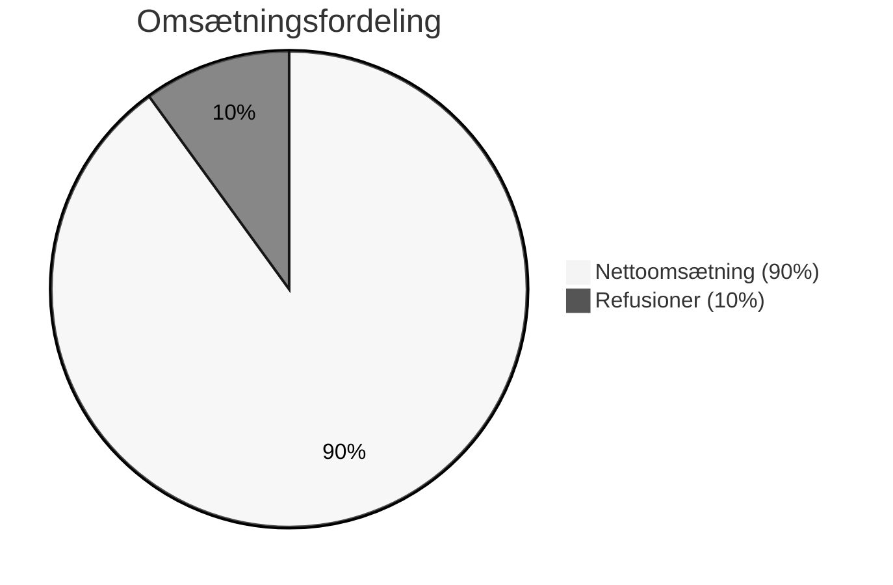
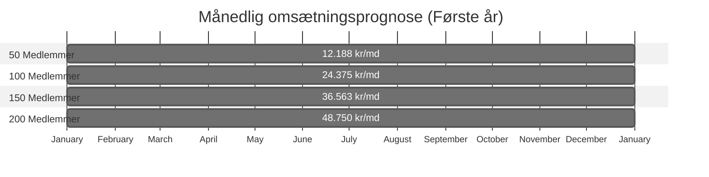
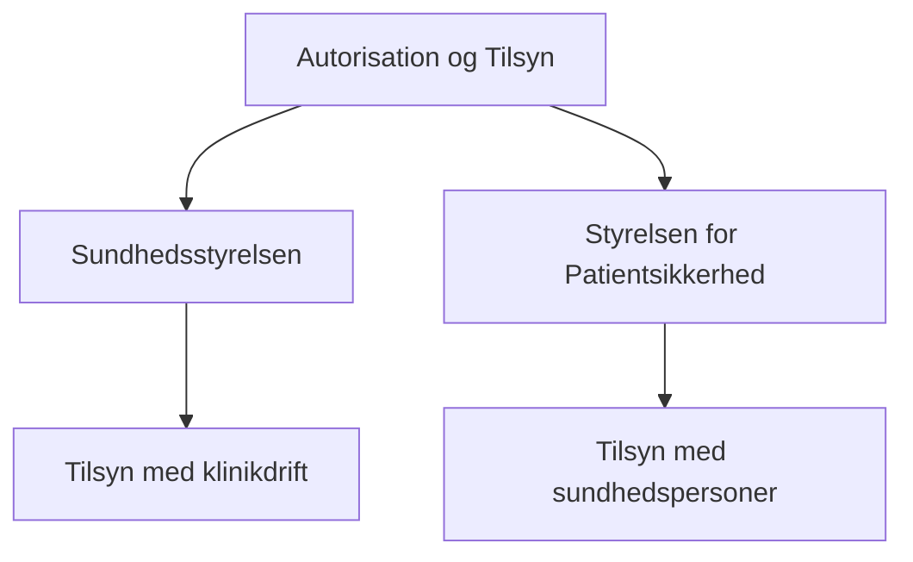
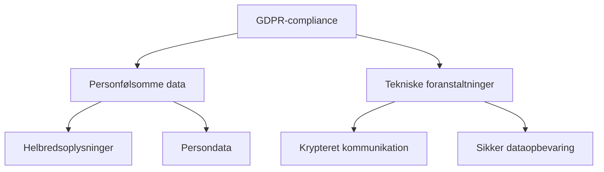
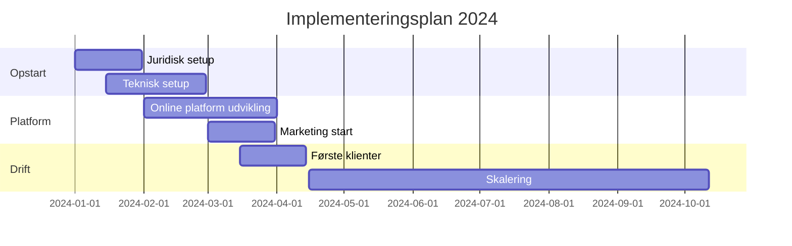

## Forretningsplan for Dansk Online Vægttabsklinik SlankLet.dk

Besøg vores hjemmeside: [https://weight-loss-fujd8nzva-jespers-projects-dbff6d83.vercel.app](https://weight-loss-fujd8nzva-jespers-projects-dbff6d83.vercel.app)
## Specialiseret i medicinsk overvågede vægttabsprogrammer

## Indholdsfortegnelse

- [1. Resumé (Executive Summary)](#1-resumé-executive-summary)
- [2. Virksomhedsbeskrivelse](#2-virksomhedsbeskrivelse)
- [3. Markedsanalyse](#3-markedsanalyse)
- [4. Forretningsmodel](#4-forretningsmodel)
- [5. Organisering](#5-organisering)
- [6. Finansiel plan](#6-finansiel-plan)
- [7. Overholdelse af regler og lovgivning](#7-overholdelse-af-regler-og-lovgivning)
- [8. Risikoanalyse](#8-risikoanalyse)
- [9. Handlingsplan og milepæle](#9-handlingsplan-og-milepæle)
- [10. Konklusion](#10-konklusion)
- [11. Referencer](#11-referencer)
- [12. Bilag](#12-bilag)

## 1. Resumé (Executive Summary)

SlankLet er en sundhedsklinik med speciale i medicinsk overvågede vægttabsprogrammer. Vi udnytter vores allerede etablerede lægepraksis til at tilbyde klienter sikre, effektive og personligt tilpassede vægttabsforløb.

### Vigtigste ydelser

* Medicinsk overvågede vægttabsprogrammer: Anvendelse af dokumenteret effektive lægemidler, såsom Wegovy® (semaglutid) og Mounjaro® (tirzepatid), i samråd med læge
* Ekspertvejledning: Ubegrænsede opfølgende konsultationer med vores sundhedsprofessionelle (læger og sygeplejersker) med henblik på tilpasning, monitorering af fremskridt og håndtering af bivirkninger
* Medlemskab: 250 kr. pr. 4. uge, med garanti for vægttab inden for 3 måneder – ellers refusion af medlemskabet

Takket være vores eksisterende lægepraksis er de løbende udgifter minimale. Vi vil fokusere på online markedsføring og overholdelse af de relevante danske regler og love (herunder Sundhedsstyrelsens og Lægemiddelstyrelsens retningslinjer) for at sikre en tryg, lovlig og professionel drift.

## 2. Virksomhedsbeskrivelse

### 2.1 Mission

Vores mission er at hjælpe personer, der døjer med overvægt, ved at tilbyde nem og sikker adgang til medicinsk overvågede vægttabsprogrammer, understøttet af personlig rådgivning fra sundhedsprofessionelle.

### 2.2 Vision

Vi ønsker at blive den førende online vægttabsklinik i Danmark, der er kendt for høj faglig kvalitet, lave omkostninger for patienterne samt dokumenterede resultater.

### 2.3 Mål

* **Kortsigtede mål:** Opbygge en stabil kundebase (f.eks. 100–200 medlemmer) inden for de første 6 måneder
* **Langsigtede mål:** Udvide til 500–1000 aktive medlemmer inden for 2 år samt etablere samarbejder med andre sundhedsaktører og forsikringsselskaber

## 3. Markedsanalyse

### 3.1 Markedets størrelse og behov
En stor andel af voksne danskere er overvægtige eller decideret fede ifølge de seneste rapporter fra Sundhedsstyrelsen [1]. Samtidig er efterspørgslen på medicinske (farmakologiske) vægttabsbehandlinger stigende, hvilket skyldes en øget opmærksomhed på GLP-1-baserede lægemidler (fx Wegovy® og Mounjaro®) [2]. Digitale tjenester vinder frem, da mange efterspørger nem adgang til sundhedsydelser uden geografisk begrænsning.

### 3.2 Konkurrencesituation

* Traditionelle vægttabsprogrammer (f.eks. kostvejledning, personlige trænere) uden direkte lægelig opfølgning
* Andre online vægttabsklinikker kan i stigende grad tilbyde lignende programmer
* **Fordel for DOV:** Vi har en etableret lægepraksis og kan derfor tilbyde solid, medicinsk baggrund og troværdighed fra dag ét

### 3.3 Målgruppe

* Primært voksne (18+) med et BMI over 27, der ønsker et medicinsk støttet vægttab
* Personer, der ønsker diskretion, komfort og fleksibilitet ved at tilgå klinikken online
* Borgere bosat i Danmark, der har mulighed for videokonsultationer og digital kommunikation

## 4. Forretningsmodel

### 4.1 Ydelser og medlemskab

#### 4.1.1 Medlemskab (250 kr. pr. 4. uge)
* **Inkluderede ydelser:**
  * Opstartskonsultation (screening) med læge
  * Løbende justeringer og ubegrænsede opfølgende konsultationer (online/videokald)
  * Personlig rådgivning om kost, motion og livsstilsændringer
  * Kontinuerlig overvågning af helbred samt opfølgning på evt. bivirkninger
* **Garanti:** Hvis der ikke opnås målbart vægttab inden for 3 måneder, refunderes medlemskabet

#### 4.1.2 Medicinsk ordination
* Medicinen (f.eks. Wegovy® og Mounjaro®) ordineres af vores praktiserende læge efter en individuel lægefaglig vurdering
* Udlevering foregår via recept på apotek. Kunden betaler selv for medicinen

## 5. Organisering

### 5.1 Ledelse og nøglepersoner
- Medicinsk ansvarlig: Dr. Peyman Pedrampour (praktiserende læge).
- Klinisk koordinator: Sygeplejerske eller klinisk assistent, som håndterer løbende kontakt med klienter og opfølgning på data.
- Kost- og livsstilsekspert (evt. diætist): Kan tilknyttes fast eller ad hoc.

### 5.2 Juridisk struktur
- Klinikken fungerer som en del af (eller i tæt samarbejde med) den eksisterende lægepraksis.
- Evt. etableres en særskilt enhed (ApS/IVS/enkeltmandsvirksomhed) for at håndtere det online forretningsområde, men stadig under lægefaglig ledelse og ansvar.

## 6. Finansiel plan

### 6.1 Omsætningsfordeling (ved 100 medlemmer)

### 6.5 Månedlig omsætningsudvikling

## 7. Overholdelse af regler og lovgivning

### 7.1 Autorisation og tilsyn

1. **Autorisation**
   - Klinikken drives af autoriserede sundhedspersoner
   - Under Sundhedsstyrelsens og Styrelsen for Patientsikkerheds tilsyn [3]
   - Læger følger Lægelovens bestemmelser

2. **Journalføring**
   - Gældende regler for journalføring
   - Sikker opbevaring af helbredsoplysninger

### 7.2 Receptudstedelse og medicinhåndtering

* **Lægemiddelstyrelsen:** Overholdelse af regler for ordination [4]
* **Risikovurdering:** Individuel vurdering ved hver ordination
* **Dokumentation:** Grundig journalføring af ordinationer

### 7.3 Markedsføring af sundhedsydelser

* Overholdelse af Markedsføringsloven og Sundhedsloven
* Saglig og ikke-vildledende markedsføring
* Særlig opmærksomhed på tidligere påbud vedrørende vægttabsmedicin [5]

### 7.4 Datahåndtering og GDPR

* Personfølsomme data (herunder helbredsoplysninger) skal opbevares og behandles i henhold til GDPR og danske databeskyttelsesregler [6]
* Krav om krypteret kommunikation ved onlineservices og videokonsultationer

## 8. Risikoanalyse

### 8.1 Identificerede risici og håndtering

| Risikotype | Beskrivelse | Håndtering |
|------------|-------------|------------|
| Regulatorisk | Stramning i regler for GLP-1-analoger [2] | Løbende monitorering af lovgivning |
| Omdømme | Klager/utilfredse kunder | Professionel håndtering og dokumentation |
| Refusion | Omkostninger ved refusioner | Buffer i økonomisk planlægning |
| Teknologi | IT-nedbrud/databrud | Backup-systemer og beredskabsplan |

## 9. Handlingsplan og milepæle

## 10. Konklusion

Dansk Online Vægttabsklinik har et betydeligt vækstpotentiale grundet:
* Stigende problem med overvægt i Danmark
* Kombination af medicinsk ekspertise og tilgængelighed
* Attraktiv prismodel med vægttabsgaranti
* Skalerbar forretningsmodel med lave faste omkostninger

## 11. Referencer

1. Sundhedsstyrelsen. "Monitorering af overvægt og fedme i Danmark." Seneste rapporter tilgængelige på [www.sst.dk](https://www.sst.dk/)

2. Sundhedsstyrelsen. "Vejledning om behandling med GLP-1 receptoragonister til voksne med overvægt." Opdateret vejledning, [www.sst.dk](https://www.sst.dk/)

3. Retsinformation. "Lov om autorisation af sundhedspersoner og om sundhedsfaglig virksomhed (Autorisationsloven)." [www.retsinformation.dk](https://www.retsinformation.dk/)

4. Lægemiddelstyrelsen. "Regler og vejledninger for ordination af lægemidler." [www.laegemiddelstyrelsen.dk](https://laegemiddelstyrelsen.dk/)

5. Styrelsen for Patientsikkerhed. "Tilsynsdatabase: tidligere påbud til vægttabsklinikker." [www.stps.dk](https://stps.dk/)

6. EU. "Databeskyttelsesforordningen (GDPR)" (EU 2016/679)

## 12. Bilag

### Bilag A: Samtykkeerklæring

# SAMTYKKEERKLÆRING
## Medicinsk Vægttabsprogram - Dansk Online Vægttabsklinik

---

### Patientinformation

**Undertegnede:**

Fulde navn: ________________________________________________

CPR-nummer: _______________________________________________

Adresse: __________________________________________________

Telefon: __________________________________________________

E-mail: ___________________________________________________

---

### Behandlingsinformation

Jeg bekræfter hermed, at jeg er blevet informeret om og giver samtykke til følgende:

#### 1. Beskrivelse af behandlingen
- Behandlingen omfatter brug af medicinske præparater (Wegovy®/semaglutid eller Mounjaro®/tirzepatid)
- Behandlingen foregår under lægelig overvågning via online konsultationer
- Behandlingen inkluderer løbende opfølgning og justering efter behov

#### 2. Formål med behandlingen
- Opnå sundhedsmæssigt forsvarligt vægttab
- Forbedre helbredsparametre relateret til overvægt
- Etablere sundere livsstilsvaner

#### 3. Mulige risici og bivirkninger
Jeg er blevet informeret om mulige bivirkninger, herunder:
- Kvalme og opkastning
- Diarré eller forstoppelse
- Andre mulige komplikationer som gennemgået med lægen

#### 4. Forventede fordele
- Mulighed for betydeligt vægttab
- Forbedring af vægtrelaterede helbredsproblemer
- Professionel støtte gennem hele forløbet

#### 5. Alternative behandlingsmuligheder
Jeg er blevet informeret om alternative metoder til vægttab, herunder:
- Kost- og livsstilsændringer uden medicinsk intervention
- Andre former for vægttabsbehandling

#### 6. Patientrettigheder
- Ret til at trække samtykke tilbage når som helst
- Ret til løbende information om behandlingen
- Ret til aktindsigt i egen journal

#### 7. Fortrolighed og databeskyttelse
- Alle personlige oplysninger behandles fortroligt
- Data håndteres i henhold til GDPR-lovgivningen [6]
- Sikker opbevaring af helbredsoplysninger

---

### Underskrifter

**Patient:**

Dato: ____/____/________

Underskrift: _____________________________________________

**Behandlende læge:**

Dato: ____/____/________

Navn: Dr. Peyman Pedrampour

Underskrift: _____________________________________________

---

### Klinikkens kontaktinformation

**SlankLet**
* Adresse: [KLINIKKENS ADRESSE]
* Telefon: [KLINIKKENS TELEFONNUMMER]
* E-mail: [KLINIKKENS E-MAIL]
* Web: www.slanklet.dk

---

*Dette dokument udskrives i to eksemplarer - ét til patienten og ét til klinikken*

### Bilag B: Tjekliste for Lovgivningsmæssig Overholdelse

| Krav | Status | Bemærkninger |
|------|--------|--------------|
| Autoriseret sundhedspersonale | ✓ | Godkendt |
| Receptudstedelse | ✓ | Følger regler |
| GDPR-compliance | ⟳ | Under review |
| Markedsføring | ⟳ | Implementeres |
| Tilsynskrav | ✓ | Godkendt |

---

### Kontaktinformation

**SlankLet)**
* **Adresse:** [Indsæt adresse]
* **Telefon:** [Indsæt telefonnummer]
* **E-mail:** [Indsæt e-mail]
* **Web:** [www.slanklet.dk](https://www.slanklet.dk)

